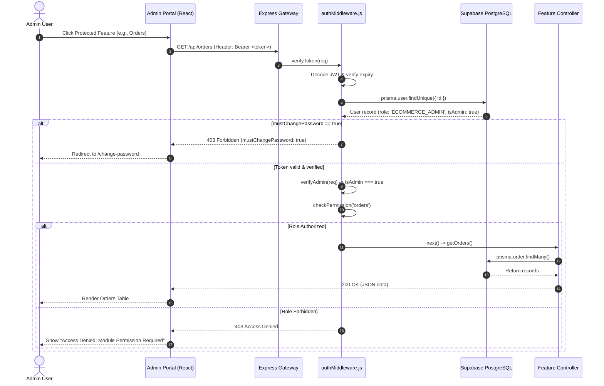
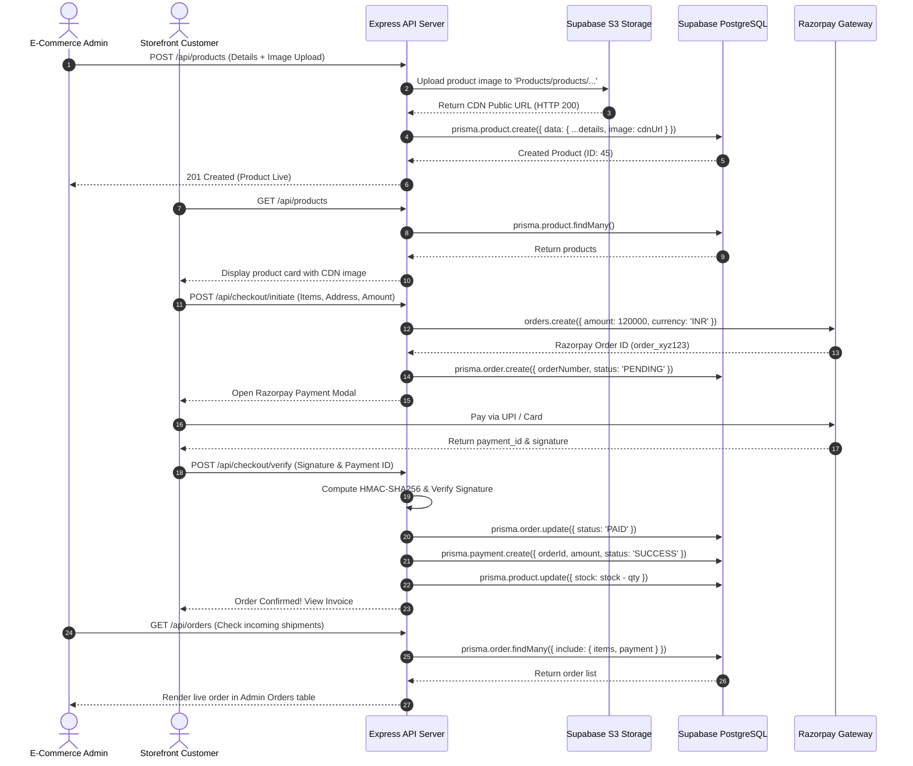
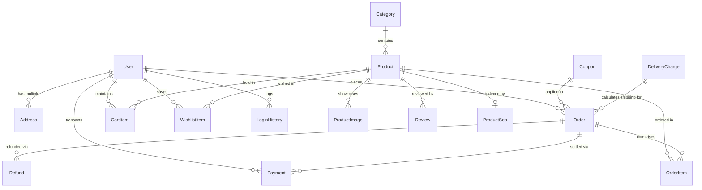

# PAIDHU ETHICAL FOODS - ADMIN PORTAL BACKEND ARCHITECTURE & DATA FLOW SPECIFICATION
**Version:** 3.0 | **Target Platform:** Supabase (`ljrwcciuacjbwocsxiqc`) & Node.js Express  
**Author:** Paidhu Engineering & Architecture Team | **Status:** Production Active

---

## 1. ARCHITECTURAL OVERVIEW & DESIGN PRINCIPLES

The Paidhu Admin Portal backend is architected as an **Enterprise Multi-Tier Micro-Modular Monolith** built on top of **Node.js, Express 5, Prisma ORM v6, and Supabase PostgreSQL 17**. 

```
┌──────────────────────────────────────────────────────────────────────────────────┐
│                             ADMIN PORTAL CLIENT (SPA)                           │
│        Vite 8 + React 19 + TailwindCSS 4 + Axios (Bearer JWT Interceptors)      │
└────────────────────────────────────────┬─────────────────────────────────────────┘
                                         │ HTTPS / JSON API Calls
                                         ▼
┌──────────────────────────────────────────────────────────────────────────────────┐
│                            API GATEWAY & NETWORK LAYER                           │
│  - Dynamic Multi-Origin CORS (admin.paidhuethicalfoods.com, localhost:5174)      │
│  - Helmet Security Headers (HSTS, CSP, X-Frame-Options, No-Sniff)               │
│  - Gzip / Deflate Compression Engine                                            │
│  - 50MB Payload JSON & URL-Encoded Parsers                                      │
└────────────────────────────────────────┬─────────────────────────────────────────┘
                                         │
                                         ▼
┌──────────────────────────────────────────────────────────────────────────────────┐
│                       SECURITY & AUTHENTICATION MIDDLEWARE                       │
│  1. verifyToken: Decodes JWT, validates expiry, verifies DB user existence       │
│  2. mustChangePassword Guard: Forces temporary password update before access     │
│  3. verifyAdmin: Enforces user.isAdmin === true                                  │
│  4. checkPermission(module): RBAC Guard for SUPER_ADMIN, ECOM, ACCOUNTS          │
└────────────────────────────────────────┬─────────────────────────────────────────┘
                                         │
                                         ▼
┌──────────────────────────────────────────────────────────────────────────────────┐
│                          CONTROLLER & BUSINESS LOGIC LAYER                       │
│  - adminController (Dashboard Analytics, Auth, Login Audit, Password Reset)      │
│  - productController (Catalog, Variants, Stock, SEO, BYOC Bundles)               │
│  - orderController (State Machine, GST Tax Engine, PDFKit Invoice Generator)     │
│  - paymentController (Razorpay HMAC-SHA256 Verification, Refund Ledger)         │
│  - settingsController (Global Store CMS, Maintenance Mode Toggle)                │
│  - ...and 15 additional dedicated domain controllers                             │
└────────────────────────────────────────┬─────────────────────────────────────────┘
                                         │
                                         ▼
┌──────────────────────────────────────────────────────────────────────────────────┐
│                               PERSISTENCE LAYER (ORM)                            │
│  Prisma Client v6 with Connection Pooling (Transaction & Session Poolers)        │
└──────────────────┬─────────────────────────────────────────────┬─────────────────┘
                   │ SQL via TLS (Port 5432)                     │ REST / S3 API
                   ▼                                             ▼
┌──────────────────────────────────────┐       ┌───────────────────────────────────┐
│     SUPABASE POSTGRESQL 17 (AWS)     │       │     SUPABASE S3 OBJECT STORAGE    │
│  Host: aws-0-ap-northeast-1          │       │  Buckets: 'Products', 'products'  │
│  28 Tables, 9,456 Records            │       │  Global CDN Public Distribution   │
│  Row-Level Security (RLS) Active     │       │  Product Images, Banners, Media   │
└──────────────────────────────────────┘       └───────────────────────────────────┘
```

---

## 2. DETAILED 7-LAYER SYSTEM ARCHITECTURE

### Layer 1: Client Presentation Tier (`/admin`)
- **Technology:** React 19, React Router v7, Axios, Recharts, React Icons, Tailwind CSS v4.
- **Session Management:** Encrypted JWT token stored in `localStorage` as `adminToken`.
- **Axios HTTP Interceptor:** Automatically injects `Authorization: Bearer <adminToken>` into the headers of every outgoing request.
- **Client Route Guards:** `ProtectedRoute` inspects user role and temporary password status (`mustChangePassword`). If expired or unauthorized, redirects to `/login` or `/change-password`.

---

### Layer 2: Network & Gateway Tier (`server/server.js`)
- **Origin Validation:**
  ```javascript
  const ALLOWED_ORIGINS = [
    'https://www.paidhuethicalfoods.com',
    'https://admin.paidhuethicalfoods.com',
    'https://accounts.paidhuethicalfoods.com',
    'https://ecommerce.paidhuethicalfoods.com',
    'http://localhost:5173',
    'http://localhost:5174'
  ];
  ```
- **Security Middleware:** 
  - `securityHeaders.js`: Applies standard enterprise headers to prevent clickjacking, MIME-sniffing, and XSS.
  - `compression()`: Compresses JSON responses using Gzip to optimize mobile and broadband network transfers.
  - Body limit set to `50mb` to permit high-definition asset uploads and extensive lead exports.

---

### Layer 3: Authentication & Role-Based Access Control (RBAC) (`server/middleware/authMiddleware.js`)
Authentication is verified in sequential stages before hitting any controller:



#### Role Hierarchy & Permission Matrix:
- **`SUPER_ADMIN`**: Wildcard `*` access. Can access all 20 modules, create/edit staff, alter system settings, process refunds, and access database tools.
- **`ECOMMERCE_ADMIN`**: Restricted to commercial and marketing operations (`products`, `orders`, `banners`, `blogs`, `saffron_guidance`, `bulk_enquiry`, `active_carts`, `profile`). Restricted from staff passwords, payments ledger, and maintenance switches.
- **`ACCOUNTS_ADMIN`**: Restricted to financial audit, stock reconciliation, and payment ledgers (`orders`, `payments`, `stock_management`, `profile`). Restricted from marketing CMS, catalog editing, and shipping status updates.

---

### Layer 4: Routing & Dispatch Layer (`server/routes/`)
Routes are modularized into dedicated domain files:
- `/api/admin` $\rightarrow$ `adminRoutes.js`
- `/api/products` $\rightarrow$ `productRoutes.js`
- `/api/orders` $\rightarrow$ `orderRoutes.js`
- `/api/payments` $\rightarrow$ `paymentRoutes.js`
- `/api/customers` $\rightarrow$ `customerRoutes.js`
- `/api/coupons` $\rightarrow$ `couponRoutes.js`
- `/api/banners` $\rightarrow$ `bannerRoutes.js`
- `/api/blogs` $\rightarrow$ `blogRoutes.js`
- `/api/settings` $\rightarrow$ `settingsRoutes.js`
- `/api/delivery-charges` $\rightarrow$ `deliveryRoutes.js`
- `/api/saffron-guidance` $\rightarrow$ `saffronGuidanceRoutes.js`
- `/api/bulk-orders` $\rightarrow$ `bulkOrdersRoutes.js`
- `/api/careers` $\rightarrow$ `careerRoutes.js`
- `/api/reviews` $\rightarrow$ `reviewRoutes.js`
- `/api/tracking` $\rightarrow$ `trackingRoutes.js`

---

### Layer 5: Business Logic & Controller Layer (`server/controllers/`)
Encapsulates transactions, calculations, data sanitization, and third-party integrations.

---

### Layer 6: Data Access & Object Relational Mapping (`server/prismaClient.js`)
- **Engine:** Prisma ORM v6 with declarative schema (`server/prisma/schema.prisma`).
- **Connection Configuration:**
  - `DATABASE_URL`: Session Pooler on port `5432` (`aws-0-ap-northeast-1.pooler.supabase.com:5432/postgres`).
  - `DIRECT_URL`: Transaction Pooler on port `6543`.
- **Query Optimization:** Selective field projections (`select: { id: true, name: true }`), chunked relation loading, and indexed lookups on `email`, `phone`, `orderNumber`, and `slug`.

---

### Layer 7: Cloud Storage & Database Layer (`ljrwcciuacjbwocsxiqc`)
- **PostgreSQL 17.6 Engine:** 28 tables, relational foreign key cascading, and RLS policies active.
- **Storage Engine:** S3-compatible Supabase Storage with public buckets `Products`, `products`, and `landing-videos`.

---

## 3. EXHAUSTIVE FEATURE-BY-FEATURE BACKEND ARCHITECTURE (ALL 20 MODULES)

```
Feature Index:
1. Admin Authentication & Session Security
2. Executive Dashboard & Telemetry
3. Product & Variant Catalog Management
4. Order Processing & State Machine
5. Customer Directory & Loyalty Points
6. Payments & Razorpay Financial Ledger
7. Coupons & Promotional Rules Engine
8. Category & Taxonomy Hierarchy
9. Banners & Responsive Hero Slider
10. Blogs & Content Synchronization
11. Customer Reviews & Reputation Moderation
12. Delivery Charges & Pincode Matrix
13. Active Carts & Cart Recovery Pipeline
14. Wishlist Demand Intelligence
15. B2B Corporate Bulk Order Pipeline
16. Tiffin Meal Subscription Leads
17. Saffron Consultation & Health Guidance
18. Career Applications & Recruitment
19. Tracking Scripts & Pixel Governance
20. Site Settings & Maintenance Mode Bridge
```

---

### Feature 1: Admin Authentication & Session Security
- **Endpoints:**
  - `POST /api/admin/login`
  - `GET /api/admin/profile`
  - `POST /api/admin/change-password`
  - `GET /api/admin/login-history`
  - `DELETE /api/admin/login-history`
- **Backend Flow:**
  1. `adminController.login`: Queries `User` by email where `isAdmin: true`.
  2. Compares raw password against bcrypt hash (`bcrypt.compare(password, user.password)`).
  3. If `mustChangePassword === true`: generates a restricted 15-minute temporary token with `mustChangePassword: true` payload, requiring immediate update at `POST /api/admin/change-password`.
  4. If standard login: records timestamp and IP in `LoginHistory` table and issues a 7-day signed JWT containing `{ userId, isAdmin: true, role }`.

---

### Feature 2: Executive Dashboard & Telemetry
- **Endpoint:** `GET /api/admin/stats`
- **Backend Flow:**
  1. `adminController.getDashboardStats`: Executes parallel Prisma aggregation queries:
     - `prisma.order.aggregate({ _sum: { totalAmount: true } })` for lifetime gross revenue.
     - `prisma.order.count()` for order volume.
     - `prisma.product.count()` for active SKUs.
     - `prisma.user.count({ where: { role: 'CUSTOMER' } })` for total customer base.
  2. Generates 30-day chronological revenue graphs by grouping completed orders by date.
  3. Extracts low-stock alerts (`stock <= 10`) to prompt inventory replenishment.

---

### Feature 3: Product & Variant Catalog Management
- **Endpoints:**
  - `GET /api/products` (supports search, category filter, pagination)
  - `POST /api/products` (creates SKU with JSON variants)
  - `PUT /api/products/:id` (updates metadata, stock, price, benefits, ingredients)
  - `DELETE /api/products/:id` (soft or hard deletes product and dependent relations)
  - `POST /api/products/upload-image` (Multer upload to Supabase storage)
- **Backend Flow:**
  1. Multer processes multipart form image $\rightarrow$ streams to Supabase bucket `Products/products/<timestamp>-<filename>`.
  2. Stores public URL: `https://ljrwcciuacjbwocsxiqc.supabase.co/storage/v1/object/public/Products/products/...`.
  3. Prisma creates `Product` record with JSONB columns for `variants`, `benefits`, `highlights`, `nutritionInfo`, and `faqData`.
  4. Auto-generates SEO slug using lowercase regex hyphenation if not explicitly provided.

---

### Feature 4: Order Processing & State Machine
- **Endpoints:**
  - `GET /api/orders` (filtering by status, customer, date)
  - `GET /api/orders/:id` (includes customer, items, payment, and delivery details)
  - `PUT /api/orders/:id/status` (transitions order lifecycle)
  - `GET /api/orders/:id/invoice` (dynamically streams PDF invoice)
- **Order State Transitions:**
  ```
  [ PENDING ] ──► [ PAID ] ──► [ PROCESSING ] ──► [ SHIPPED ] ──► [ DELIVERED ]
       │              │               │               │
       └──────────────┴───────────────┴───────────────┴────────► [ CANCELLED ]
  ```
- **Invoice Generation Engine:**
  - Utilizes `PDFKit` to dynamically assemble GST-compliant invoices containing Paidhu logo, tax breakdown (CGST/SGST), SKU line items, customer billing/shipping addresses, and payment references.

---

### Feature 5: Customer Directory & Loyalty Points
- **Endpoints:**
  - `GET /api/customers` (paginated customer list)
  - `GET /api/customers/:id` (order history, addresses, saved items)
  - `PUT /api/customers/:id` (update reward points, membership tier)
- **Backend Flow:**
  1. `customerController.getCustomers`: Fetches all `User` records where `role = 'CUSTOMER'`.
  2. Sub-selects total orders placed and total money spent using relational joins on `Order`.
  3. Allows Super Admin to reward loyalty points directly to customer accounts.

---

### Feature 6: Payments & Razorpay Financial Ledger
- **Endpoints:**
  - `GET /api/payments` (lists all financial transactions)
  - `POST /api/checkout/verify` (HMAC-SHA256 signature verification)
  - `POST /api/payments/refund` (triggers Razorpay refund API and updates ledger)
- **Security Verification Flow:**
  ```javascript
  const hmac = crypto.createHmac('sha256', process.env.RAZORPAY_KEY_SECRET);
  hmac.update(razorpay_order_id + '|' + razorpay_payment_id);
  const generatedSignature = hmac.digest('hex');
  const isValid = generatedSignature === razorpay_signature;
  ```
  Guarantees zero payment spoofing or unauthorized order status alterations.

---

### Feature 7: Coupons & Promotional Rules Engine
- **Endpoints:**
  - `GET /api/coupons`
  - `POST /api/coupons`
  - `PUT /api/coupons/:id`
  - `DELETE /api/coupons/:id`
  - `POST /api/coupons/validate`
- **Validation Algorithm:**
  1. Checks if coupon code exists in `Coupon` table and is marked `isActive: true`.
  2. Compares `new Date()` against `startDate` and `expiryDate`.
  3. Asserts cart subtotal $\ge$ `minCartValue`.
  4. Verifies total times used $<$ `usageLimit`.
  5. Applies discount (`PERCENTAGE` with `maxDiscount` cap OR `FLAT` value).

---

### Feature 8: Category & Taxonomy Hierarchy
- **Endpoints:**
  - `GET /api/products/categories`
  - `POST /api/products/categories`
  - `PUT /api/products/categories/:id`
  - `DELETE /api/products/categories/:id`
- **Backend Flow:**
  - Manages primary store categories (Bloom Cookies, Petal Jams, Pure Saffron, Floral Teas, Brew Flora, Saffron Giftbox).
  - Enforces relational safety: blocks category deletion if active `Product` records reference its `categoryId`.

---

### Feature 9: Banners & Responsive Hero Slider
- **Endpoints:**
  - `GET /api/banners`
  - `POST /api/banners`
  - `PUT /api/banners/:id`
  - `DELETE /api/banners/:id`
- **Backend Flow:**
  - Stores dual responsive media URLs: `webImage` (desktop 1920x427 landscape) and `mobileImage` (mobile 800x800 square).
  - Associates banners with page slugs (`home`, `shop`, `saffron`) or categories, allowing instant visual refreshes without code deployments.

---

### Feature 10: Blogs & Educational Content
- **Endpoints:**
  - `GET /api/blogs`
  - `POST /api/blogs`
  - `PUT /api/blogs/:id`
  - `DELETE /api/blogs/:id`
  - `POST /api/sync/blogs` (triggers manual WordPress REST sync)
- **Backend Flow:**
  - Full CRUD for rich-text blogs with JSON tags, categories, author metadata, and reading time computation.
  - Background node-cron (`server/cron/syncBlogs.js`) periodically synchronizes posts from external WordPress endpoints into the PostgreSQL `Blog` table.

---

### Feature 11: Customer Reviews & Reputation Moderation
- **Endpoints:**
  - `GET /api/reviews`
  - `PUT /api/reviews/:id/approve`
  - `DELETE /api/reviews/:id`
- **Backend Flow:**
  - Moderates verified buyer feedback. Only reviews with `isApproved = true` are exposed to the storefront product pages.
  - Recalculates average star rating for the corresponding `Product` upon approval.

---

### Feature 12: Delivery Charges & Pincode Matrix
- **Endpoints:**
  - `GET /api/delivery-charges`
  - `POST /api/delivery-charges`
  - `PUT /api/delivery-charges/:id`
  - `DELETE /api/delivery-charges/:id`
- **Backend Flow:**
  - Manages national delivery fee rules, free shipping thresholds (e.g., Free above ₹499), flat rate fallback charges, and regional pincode tiers.

---

### Feature 13: Active Carts & Cart Recovery Pipeline
- **Endpoints:**
  - `GET /api/cart/active`
  - `GET /api/cart/abandoned`
- **Backend Flow:**
  - Queries `CartItem` joined with `User` and `Product`. Identifies carts with no updates in $>$ 24 hours.
  - Generates one-click WhatsApp recovery messages pre-populated with customer name, cart item names, and direct checkout link.

---

### Feature 14: Wishlist Demand Intelligence
- **Endpoints:**
  - `GET /api/wishlist/insights`
  - `GET /api/wishlist/all`
- **Backend Flow:**
  - Groups records in `WishlistItem` by `productId` to rank the most desired products across the entire customer base.
  - Supplies predictive purchasing data for agricultural flower harvest planning.

---

### Feature 15: B2B Corporate Bulk Order Pipeline
- **Endpoints:**
  - `GET /api/bulk-orders`
  - `PUT /api/bulk-orders/:id/status`
  - `DELETE /api/bulk-orders/:id`
- **Backend Flow:**
  - Captures and manages corporate gifting inquiries, custom flower infusion requests, company details, estimated quantity, and deal stage (`Pending`, `Contacted`, `Quoted`, `Closed`).

---

### Feature 16: Tiffin Meal Subscription Leads
- **Endpoints:**
  - `GET /api/admin/tiffin-registrations`
  - `PUT /api/admin/tiffin-registrations/:id/status`
- **Backend Flow:**
  - Manages dietary subscriptions for floral-infused tiffins, delivery meal schedules (Lunch/Dinner), delivery addresses, and customer meal notes.

---

### Feature 17: Saffron Consultation & Health Guidance
- **Endpoints:**
  - `GET /api/saffron-guidance`
  - `PUT /api/saffron-guidance/:id/status`
- **Backend Flow:**
  - Tracks high-value saffron health consultation requests from pregnant women and ayurvedic practitioners.
  - Manages trimester data, consultation phone calls, and personalized saffron dosage prescriptions.

---

### Feature 18: Career Applications & Recruitment
- **Endpoints:**
  - `GET /api/careers/applications`
  - `PUT /api/careers/applications/:id/status`
- **Backend Flow:**
  - Stores job seeker submissions with uploaded PDF/Doc resume links hosted in Supabase storage, position applied for, portfolio links, and interview progression.

---

### Feature 19: Tracking Scripts & Pixel Governance
- **Endpoints:**
  - `GET /api/tracking`
  - `POST /api/tracking`
  - `PUT /api/tracking/:id`
  - `DELETE /api/tracking/:id`
- **Backend Flow:**
  - Stores script snippets in the `TrackingScript` table.
  - Categorized by position (`head` vs `body`) and platform (Google Analytics 4, Google Tag Manager, Meta Pixel, Microsoft Clarity).
  - Dynamically injected into the frontend DOM via `useTracking` hook, eliminating the need to modify repository code or redeploy on marketing script changes.

---

### Feature 20: Site Settings & Maintenance Mode Bridge
- **Endpoints:**
  - `GET /api/settings`
  - `PUT /api/settings`
  - `PUT /api/settings/maintenance`
- **Backend Flow:**
  - Manages single-row singleton configuration in the `SiteSettings` table.
  - Stores emergency WhatsApp routing phone number (`8754787774`), company tax GSTIN, primary support email, and the global `isMaintenanceMode` switch.

---

## 4. END-TO-END DATA FLOW TRACE: PRODUCT CREATION TO CHECKOUT & ADMIN AUDIT



---

## 5. DATABASE ENTITY RELATIONSHIP (SCHEMA) TOPOLOGY

The database consists of **28 strongly typed PostgreSQL tables**. Below is the core relational topology:



---

## 6. BACKEND SECURITY & INTEGRITY SAFEGUARDS

1. **SQL Injection Immunity:** All database read/write queries are executed using Prisma Client parameterized statements. Raw SQL queries utilize strictly parameterized `$executeRawUnsafe` calls with input sanitization.
2. **Password Cryptography:** Admin and customer passwords are protected using `bcryptjs` with salt work factor of 10 (`$2b$10$...`). Plaintext passwords are never logged, transmitted in responses, or stored.
3. **Database Sequence Alignment:** All PostgreSQL `SERIAL` sequences are synced with `setval(pg_get_serial_sequence(), MAX(id))` to guarantee that new insertions cannot collide with existing restored records.
4. **Environment Isolation:** Secrets (`DATABASE_URL`, `JWT_SECRET`, `SUPABASE_SERVICE_ROLE_KEY`, `RAZORPAY_KEY_SECRET`) are managed strictly through server-side `.env` variables and are excluded from git commits and client bundles.
5. **CORS Hardening:** Strict origin whitelisting ensures that unauthorized external web domains cannot trigger admin APIs or access sensitive customer data.
